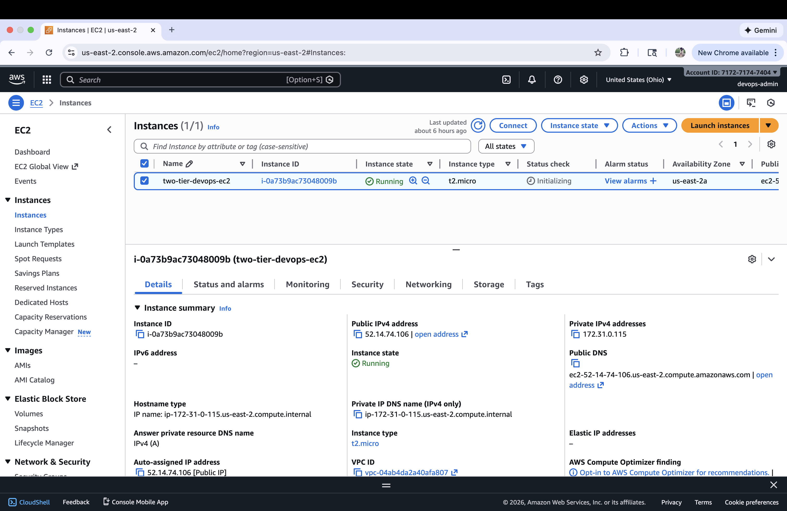

# DevOps Project Report: Automated CI/CD Pipeline for a 2-Tier Flask Application on AWS

**Author:** Bhavya Reddy Ganta  
**Date:** January 2026  

---

## Table of Contents

1. [Project Overview](#project-overview)  
2. [Architecture Diagram](#architecture-diagram)  
3. [Step 1: AWS EC2 Instance Preparation](#step-1-aws-ec2-instance-preparation)  
4. [Step 2: Install Dependencies on EC2](#step-2-install-dependencies-on-ec2)  
5. [Step 3: Jenkins Installation and Setup](#step-3-jenkins-installation-and-setup)  
6. [Step 4: GitHub Repository Configuration](#step-4-github-repository-configuration)  
   - [Dockerfile](#dockerfile)  
   - [docker-compose.yml](#docker-composeyml)  
   - [Jenkinsfile](#jenkinsfile)  
7. [Step 5: Jenkins Pipeline Creation and Execution](#step-5-jenkins-pipeline-creation-and-execution)  
8. [Conclusion](#conclusion)  
9. [Infrastructure Diagram](#infrastructure-diagram)  
10. [Work Flow Diagram](#work-flow-diagram)  

---

## 1. Project Overview

This document outlines the step-by-step process for deploying a **2-tier web application (Flask + MySQL)** on an **AWS EC2 instance**.  
The deployment is containerized using **Docker** and **Docker Compose**.  

A full **CI/CD pipeline** is established using **Jenkins** to automate the build and deployment process whenever new code is pushed to a **GitHub repository**.

The objective of this project is to demonstrate:
- Automated CI/CD using Jenkins  
- Containerized application deployment using Docker  
- Multi-container orchestration using Docker Compose  
- End-to-end DevOps workflow on AWS EC2 (t2.micro, us-east-1)

---
## 2. Architecture Diagram

The following diagram represents the high-level architecture and workflow of the CI/CD pipeline used in this project.

```text
+-----------------+      +----------------------+      +-----------------------------+
|   Developer     |----->|     GitHub Repo      |----->|        Jenkins Server       |
| (pushes code)   |      | (Source Code Mgmt)   |      |  (on AWS EC2)               |
+-----------------+      +----------------------+      |                             |
                                                       | 1. Clones Repo              |
                                                       | 2. Builds Docker Image      |
                                                       | 3. Runs Docker Compose      |
                                                       +--------------+--------------+
                                                                      |
                                                                      | Deploys
                                                                      v
                                                       +-----------------------------+
                                                       |      Application Server     |
                                                       |      (Same AWS EC2)         |
                                                       |                             |
                                                       | +-------------------------+ |
                                                       | | Docker Container: Flask | |
                                                       | +-------------------------+ |
                                                       |              |              |
                                                       |              v              |
                                                       | +-------------------------+ |
                                                       | | Docker Container: MySQL | |
                                                       | +-------------------------+ |
                                                       +-----------------------------+


---

## 3. Step 1: AWS EC2 Instance Preparation

### 1. Launch EC2 Instance
- Navigate to the **AWS EC2 Console**
- Launch a new EC2 instance using the **Ubuntu 22.04 LTS AMI**
- Select the **t2.micro** instance type (free-tier eligible)
- Choose the **us-east-1** region
- Create and assign a **key pair** for SSH access




---

### 2. Configure Security Group
Create a security group with the following inbound rules:

- **SSH** – TCP – Port **22** – Source: Your IP  
- **HTTP** – TCP – Port **80** – Source: Anywhere (0.0.0.0/0)  
- **Custom TCP** – Port **5000** (Flask) – Source: Anywhere (0.0.0.0/0)  
- **Custom TCP** – Port **8080** (Jenkins) – Source: Anywhere (0.0.0.0/0)  

---

### 3. Connect to EC2 Instance
```bash
ssh -i <your-key.pem> ubuntu@<public-ip-address>


